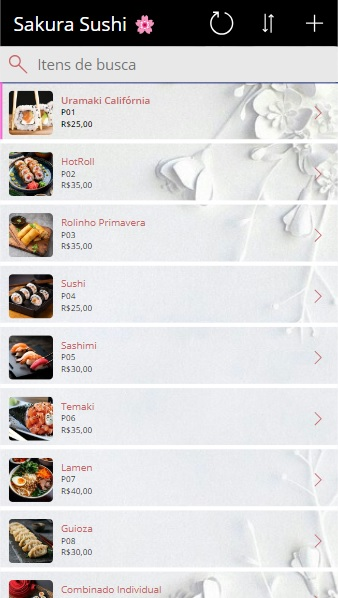
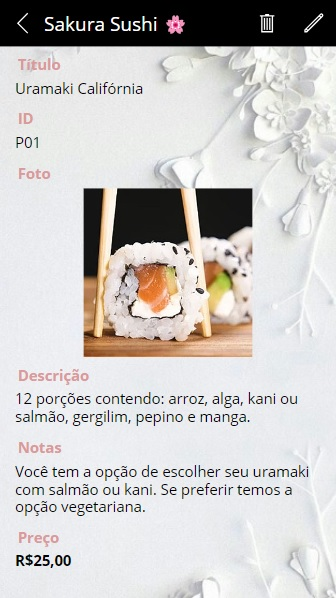
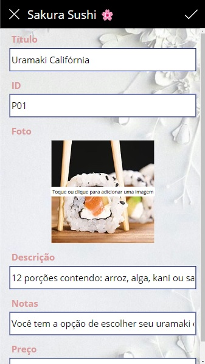

<h1 align="center">
    <a href="https://fernanda1701.github.io/sakura-sushi-power-apps/">Sakura Sushi 🌸</a>
</h1>

 <b>Desafio 1</b> - Mentoria Girls Power Microsoft - Criação de um App de 3 telas utilizando o Power Apps

<h2 align="center">

</h2>

## 💎 Sobre

O projeto foi desenvolvido para a fixação de conhecimentos em <b><i>Power Apps</i></b>.
O desafio era criar um App de 3 telas a partir de uma tabela do <b>Excel</b>, onde deveria conter um cardápio de um restaurante fictício de sua escolha, possuindo imagens e seus respectivos conteúdos.

## 📖 Contexto do App

 

<b><i>Sakura Sushi</b></i> 🌸 é um restaurante japonês que estava precisando de uma modernização em seu Cardápio. Por isso, foi criado em Power Apps, um Aplicativo para atender essa necessidade. 

O Aplicativo, denominado: “Sakura Sushi Menu”, tem a finalidade de demonstrar as delícias que são servidas no restaurante, dentre elas, pratos principais, sucos e sobremesas. 

O Menu é dividido em 3 telas, sendo: 

- Tela 1, a principal, demonstrando o Menu em lista; 

<h3 align="center">Tela 1</h3>

  

 - Tela 2, contendo a descrição detalhada do prato e suas opções; 
 
 <h3 align="center">Tela 2</h3>

  

- Tela 3, uma tela de edição, onde podemos atualizar, excluir ou criar um novo item no cardápio.  

 <h3 align="center">Tela 3</h3>

  

### Características

Os dados dos itens demonstrados no Aplicativo são: 
- [x] nome 
- [x] número de identidade na empresa (ID)
- [x] foto
- [x] descrição 
- [x] notas (informações adicionais)  
- [x] preço  

As telas possuem transições suavizadas com Fade, possuem padrão de organização (na tela 1, os itens são organizados por ID e nas demais possuem ordenação iguais dos dados) e foram aplicados padrões de formatação de texto para a demonstração correta de valores (R$00,00; por exemplo). Foi adicionado um plano de fundo e cores que harmonizassem melhor com a estética do restaurante. 

## 🛠 Tecnologias
 
- [Power Apps](https://www.microsoft.com/pt-br/power-platform/products/power-apps)
- [Excel](https://www.microsoft.com/pt-br/microsoft-365/excel)
- Versionamento de código no [Git](https://git-scm.com/)

## Autor:

<a href="https://github.com/Fernanda1701">
 
  
 <b>Fernanda Nascimento</b></a> 

Entre em contato ✉️:

